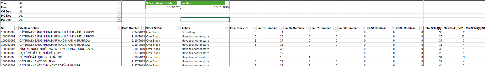

# 🏬 3PL Inventory Optimization & Store Reallocation Report
> _Tối ưu tồn kho tại 3PL và hệ thống cửa hàng – ra quyết định dựa trên dữ liệu để giảm chi phí và tăng doanh thu._

---

## 📘 Giới thiệu
Trong hoạt động vận hành hàng nhập khẩu, công ty sử dụng **3PL (Third-Party Logistics)** để lưu trữ hàng hóa.  
Tuy nhiên, khi số lượng SKU và đơn hàng tăng, việc phân bổ hàng hóa về cửa hàng không triệt để dẫn đến **hàng tồn ở kho 3PL** hoặc **hàng hoàn trả từ cửa hàng về kho 3PL**, gây tốn **chi phí lưu trữ đáng kể**.

Đồng thời, **không có một báo cáo trung tâm nào** giúp công ty theo dõi chính xác lượng hàng đang tồn ở 3PL, SKU nào đang bán chạy/chậm tại từng cửa hàng, hoặc xác định đâu là hành động cần thực hiện để **tối ưu việc trưng bày và luân chuyển hàng hóa**.

---

## 🎯 Mục tiêu dự án
- Giảm chi phí lưu trữ tại kho 3PL bằng cách đưa hàng ra cửa hàng nhanh nhất có thể.  
- Tăng tốc độ luân chuyển hàng hóa giữa kho và cửa hàng, đảm bảo hàng bán chạy luôn có sẵn.  
- Hạn chế tình trạng **Out of Stock** hoặc **Overstock** tại cửa hàng.  
- Phân bổ lại SKU hiệu quả giữa các cửa hàng để phù hợp với nhu cầu thực tế và thị hiếu khách hàng.  
- Hỗ trợ ra quyết định bằng **hành động gợi ý (Action Recommendation)** trong báo cáo.  
- Cập nhật dữ liệu **hàng tuần**, đảm bảo độ chính xác và kịp thời trong vận hành.

---

## 🧩 Giải pháp thực hiện
1. **Phối hợp & thu thập dữ liệu chuẩn**
   - Làm việc cùng các cửa hàng để xác định **Ideal Stock (tồn kho lý tưởng)** cho từng SKU.  
   - Tổng hợp dữ liệu từ nhiều nguồn: **Stock ở kho 3PL**, **Stock tại từng cửa hàng**, **dữ liệu Sales theo SKU & Store**.

2. **Tổng hợp & xử lý dữ liệu bằng Power Query**
   - Chuẩn hóa dữ liệu tồn kho, xử lý giá trị trống, định dạng SKU và đơn vị.  
   - Tạo mối liên kết dữ liệu giữa các bảng để dễ dàng phân tích.  

3. **Xây dựng logic phân tích trong Excel**
   - Dùng **Conditional Column** và **DAX** để tính toán các chỉ số và hành động:  
     - “Do Nothing”  
     - “Move to Another Store”  
     - “Get Stock from Warehouse”  
     - “Get Stock from Warehouse and Another Store”  
   - Tạo cột **Stock Status** tự động phân loại SKU theo:  
     - Low Stock  
     - In Stock  
     - Out of Stock  
     - Over Stock  

4. **Thiết kế giao diện báo cáo thân thiện**
   - Dùng **Pivot Table** và **Slicer** để phân tích theo nhiều chiều: ngành hàng, thời gian, cửa hàng.  
   - Bổ sung Slicer để lọc SKU theo ngành hàng, hoặc điều chỉnh theo giai đoạn bán hàng.  
   - Dễ dàng refresh hàng tuần chỉ bằng thao tác đơn giản.

---

## 📊 Kết quả đạt được

- **Giảm thiểu chi phí lưu kho 3PL** nhờ đưa hàng hóa ra cửa hàng nhanh hơn.  
- **Tối ưu tồn kho hệ thống**: tránh thừa ở nơi này, thiếu ở nơi khác.  
- **Tăng doanh thu thực tế** nhờ đảm bảo hàng bán chạy luôn sẵn sàng.  
- **Tăng hiệu quả vận hành** – user không cần xử lý thủ công, chỉ cần dựa vào “Action Recommendation” có sẵn.  
- **Xây dựng được nền tảng dữ liệu tập trung** cho việc ra quyết định phân bổ hàng hóa.  

---

## 🛠️ Công cụ & Kỹ thuật sử dụng
| Công cụ / Kỹ thuật | Mục đích sử dụng |
|--------------------|----------------|
| **Power Query** | Tổng hợp, làm sạch, chuẩn hóa dữ liệu từ nhiều nguồn |
| **Excel DAX** | Tính toán và tạo cột “Action” / “Stock Status” tự động |
| **Pivot Table / Slicer** | Lọc và phân tích dữ liệu trực quan |
| **Excel** | Công cụ chính, thân thiện và phổ biến với người dùng |
| **Inventory Analysis Logic** | So sánh tồn kho, Ideal Stock và doanh số để gợi ý hành động |

---

## 📸 Kết quả
### Hình ảnh

  

---

## ✉️ Tác giả
**Tram Dang Tai**  
📍 Merchandise Assistant Database  
📧 [Liên hệ qua LinkedIn](https://www.linkedin.com/in/tramdangtai)
